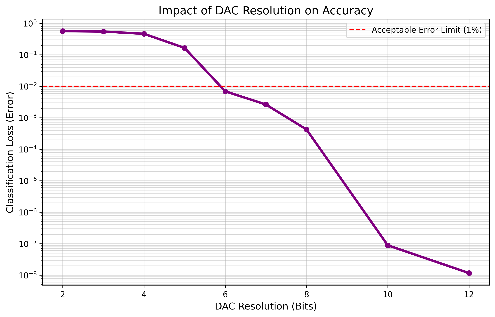

# Optical Driver Quantization Analysis
**Feasibility study on low-bit DACs for Hybrid Pockels Optical Neural Networks.**

## 📖 Overview
This project investigates the impact of **Digital-to-Analog Converter (DAC) resolution** on the inference accuracy of photonic integrated circuits (PICs).
By simulating the quantization noise in control voltages, we aim to determine the **minimum bit-depth required** to maintain high classification accuracy.

## 🎯 Objective
High-precision DACs (e.g., 12-bit or 16-bit) are expensive and power-hungry. 
If optical neural networks can operate with low-precision drivers (e.g., 4-bit to 6-bit), the total system cost and power consumption can be drastically reduced.

## 🔬 Experiment Setup
- **Task**: 2x2 Image Classification (Orthogonal Phase Encoding).
- **Device**: 4x4 Universal MZI Mesh (Hybrid Pockels Effect, $r=100$ pm/V).
- **Method**: 
    1. Train the model with infinite precision (Float64).
    2. Quantize the optimized voltages to $N$-bit levels.
    3. Measure the degradation in classification loss.

## 📊 Key Results

### The "6-bit" Threshold
Our simulation reveals a clear turning point at **6-bit resolution**.

- **< 4-bit**: Significant accuracy degradation (High Loss).
- **5-bit**: Improved, but still noticeable error.
- **6-bit**: **Achieves < 1% Loss (Success).** Performance is comparable to ideal infinite precision.
- **> 8-bit**: Over-specification (Diminishing returns).

## 💡 Conclusion & Implication
**An inexpensive 6-bit DAC is sufficient for high-accuracy optical computing.**
There is no need for high-end 12-bit drivers. This finding suggests a pathway to **low-cost, mass-producible optical AI accelerators**.

## 🛠 Technology Stack
- **Simulator**: DiffPhoton (JAX-based Physics Engine)
- **Optimization**: Optax
- **Analysis**: Matplotlib

## 👨‍💻 Author
**Optical DAC Analysis Project**
